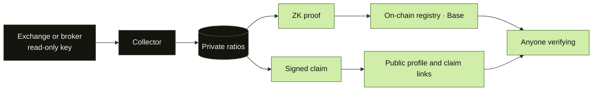
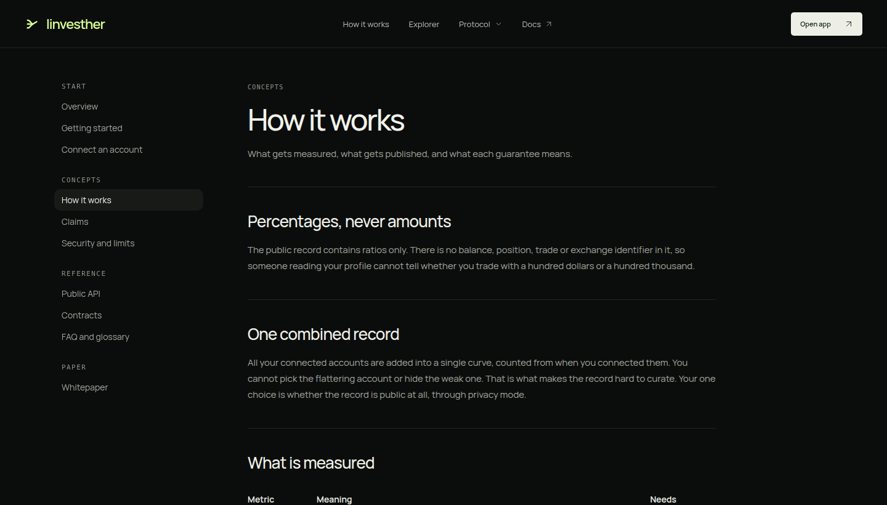
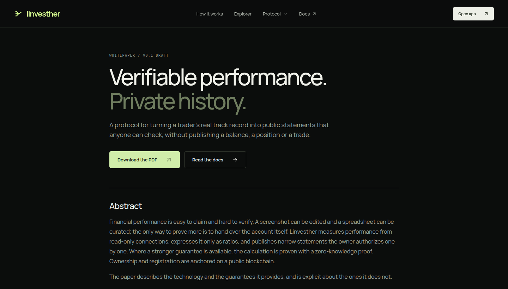

<div align="center">


<br>

[](LICENSE)
[](docs/architecture.md#the-public-registry)
[](docs/architecture.md#measurement)
[](docs/architecture.md#zero-knowledge-proofs)


**Turn a real track record into public statements anyone can check.<br>
No balance, no position, no trade is ever published.**

[Whitepaper](apps/web/public/linvesther-whitepaper.pdf) ·
[Architecture](docs/architecture.md) ·
[Contributing](CONTRIBUTING.md) ·
[Security](SECURITY.md)

</div>

<br>

## Why

A track record is easy to claim and hard to verify. A screenshot can be edited,
a spreadsheet can be curated, and the only way to prove more is to hand over the
account itself.

Linvesther takes a third path: performance is measured from read-only
connections, expressed only as ratios, and published as narrow statements the
owner authorizes one by one.

## What you get

| | |
| --- | --- |
| **Read-only connections** | Binance, Coinbase and Interactive Brokers. Keys that can trade or withdraw are rejected. |
| **One combined record** | All connected accounts are added together. You cannot pick the flattering ones. |
| **Percentages only** | Return, max drawdown, Sharpe ratio and win rate. Never an amount. |
| **Claims** | A signed statement like "return at least 10%", shared as a link. It shows the threshold, not the figure. |
| **Privacy mode** | One switch hides the whole public record. |
| **Proofs** | Zero-knowledge proofs of the performance calculation, checkable without the data. |
| **Public registry** | Identities and optional profile text live in immutable contracts on Base. |

## How it works



Everything on the left of the private/public line stays with the owner. Only a
signed statement, a proof or a ratio crosses it. See
[docs/architecture.md](docs/architecture.md).

## A closer look

<table>
  <tr>
    <td width="50%"></td>
    <td width="50%"></td>
  </tr>
  <tr>
    <td align="center"><sub>Documentation for users and developers</sub></td>
    <td align="center"><sub>Whitepaper: the technology and its limits</sub></td>
  </tr>
</table>

## Repository layout

```text
apps/
  web/                  Next.js app, documentation and landing page
  api/                  Fastify API: sessions, claims, public profiles
contracts/              Solidity registries and smart accounts (Foundry)
services/
  chain-worker/         Chain indexer, relayer and identity flows
  collector/            Exchange and broker collectors, worker binary (Rust)
crates/                 Domain logic, commitments and verifier (Rust)
zkvm/                   Zero-knowledge guest programs (RISC Zero)
packages/               Shared protocol and connector conformance packages
infra/                  Local PostgreSQL and recovery tooling
docs/                   Architecture and whitepaper source
tests/                  End-to-end suites
```

## Getting started

You need Node.js 24, pnpm 11, a stable Rust toolchain, [Foundry](https://getfoundry.sh)
and Docker for PostgreSQL. Proving needs the RISC Zero toolchain; build the worker
with `--no-default-features` to skip it.

```sh
git clone --recurse-submodules <this repository>
cd LinvestherZK
pnpm install
infra/local/up.sh                # database, local chain, contracts and .env.local
cargo build -p binance-worker --manifest-path services/Cargo.toml
set -a; source .env.local; set +a; pnpm --filter @linvestherzk/api start
pnpm --filter @linvestherzk/web dev
```

That runs everything on your machine with no outside network. See
[Run it yourself](apps/web/app/docs/self-hosting/page.tsx) for what it creates,
what is kept across restarts and how your instance fits into trust.

Run every check with:

```sh
make check-build check-rust check-contracts check-integration check-zk check-e2e
```

## Status

Linvesther is early software. The registry runs on the **Base Sepolia test
network** and has not had an independent security review. Proofs of performance
exist per exchange account; proofs for the combined record and for claims are on
the [roadmap](CHANGELOG.md#unreleased).

## Contributing

Issues and pull requests are welcome. Start with [CONTRIBUTING.md](CONTRIBUTING.md).
To report a vulnerability, see [SECURITY.md](SECURITY.md).

## License

Apache-2.0. See [LICENSE](LICENSE).
