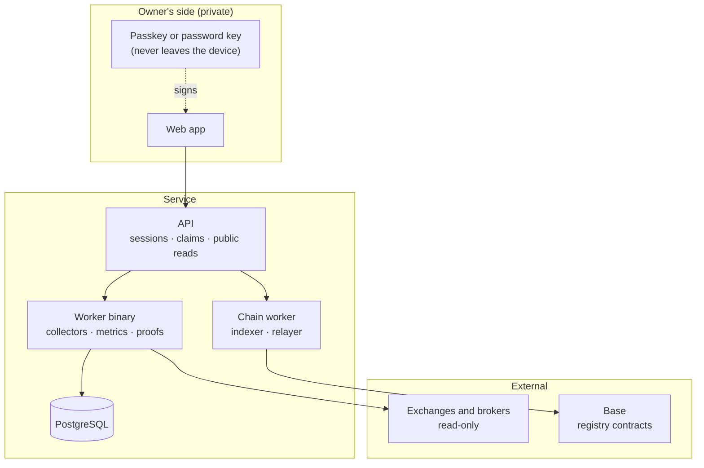

# Architecture

Linvesther measures performance from read-only account connections, publishes
only ratios, and lets the owner authorize narrow statements about them. Ownership
is anchored on a public blockchain. This page describes how the parts fit; the
[whitepaper](../apps/web/public/linvesther-whitepaper.pdf) covers the reasoning.



## Components

| Component | Role |
| --- | --- |
| `apps/web` | The web app, documentation and landing page. Holds the owner's key in the browser. |
| `apps/api` | Verifies sign-ins, serves public profiles and claims, and gates every state change. |
| `services/collector` | Reads exchanges and brokers with read-only credentials and computes metrics. Runs as the `binance-worker` binary. |
| `services/chain-worker` | Indexes registry events and relays signed commands to the chain. |
| `contracts` | The registries and the smart accounts that represent identities. |
| `crates`, `zkvm` | Domain logic, commitments, the verifier and the zero-knowledge guest programs. |

## State

| State | Kept in |
| --- | --- |
| Sign-ins (30 days), identities, passkeys, published claims, profile settings | PostgreSQL, when `DATABASE_URL` is set |
| Connected accounts (credentials encrypted) and collected history | PostgreSQL, written by the worker |
| Ownership, bindings, profile text and proofs | The chain |

Without a database the API keeps the first group in memory and says so at start-up.
Sign-in challenges are always in memory, so the API runs as a single instance. Each
store has an in-memory and a Postgres implementation asserted by the same tests.

`infra/local/up.sh` starts all of this locally with no outside network: a
Postgres database, a local chain with the contracts deployed and an `.env.local`.

## Identity

An identity is a P-256 public key, held as a passkey (WebAuthn) or as a
password-encrypted key in the browser. It is represented on-chain by a smart
account that validates signatures by the ERC-1271 standard, so the same key can
sign ordinary messages and EIP-712 typed data that contracts can check.

A change of owner takes two steps: the current owner proposes it, and it takes
effect only when confirmed.

## Measurement

Connections are read-only; credentials that carry trading, transfer or withdrawal
permissions are rejected. Return is a **time-weighted return**: the period is
split at every external cash flow and the sub-period returns are chained, so a
deposit never looks like performance.

```text
r_j = V_end_j / V_start_j - 1        I_j = I_(j-1) * (1 + r_j)        R[a,b] = I_b / I_a - 1
```

Maximum drawdown, Sharpe ratio and win rate derive from the same curve. Each has
a minimum sample; below it the metric is reported as unavailable, never as zero.
Connected accounts are merged into one curve, in which a transfer between two of
the owner's accounts is neutral.

## Claims

A claim is a statement such as "return at least 10%". It carries the identity,
period, statements, audience, a nonce and an expiry, and is hashed as canonical
JSON (RFC 8785) with SHA-256. The owner signs the digest, so changing any field
after signing invalidates it. Before a claim is accepted it is checked against
the owner's current figures. A claim reveals whether a threshold is met, not the
figure.

A signature is consent, not proof of computation.

## Zero-knowledge proofs

The metric calculation is a program that runs in the RISC Zero zkVM and produces
a receipt. The receipt binds the program's image identifier, a public journal
(for example the period and a result) and a proof of correct execution. Private
inputs appear only as commitments. A verifier needs the receipt and an
independent source for the accepted image identifier.

Proofs exist today per exchange account. Proofs for the combined record and for
claims are planned.

The journal also records the fingerprint of the collector key that signed the
source data. A proof shows a calculation is right, not that the data was honest,
so a verifier compares that fingerprint with a list of collectors it trusts
(`trust/collectors.json`, or its own). A signer that is not on the list is
reported as **self-attested**, and the command-line verifier does not exit
cleanly on it unless told to. See [Verify a proof](../apps/web/app/docs/verify/page.tsx).

## The public registry

Contracts on **Base** (currently the Sepolia test network) record identities,
account bindings, optional profile text and proof checkpoints. They have no
upgrade proxy. A state change is authorized by the owner's signature, checked
on-chain, so any party can pay the fee and submit it.

| Contract | Purpose |
| --- | --- |
| `IdentityRegistry` | Identities, tracks and owner rotation |
| `AccountRegistry` | Which accounts are bound to a track, and when |
| `ProfileRegistry` | Optional public name and bio |
| `CheckpointRegistry` | Checkpoints to which a proof can be attached |

Only ownership, commitments and proofs are registered. Trading data is never
written on-chain.

## Trust model

A result is judged on five independent questions: **origin** (who supplied the
data), **coverage** (is the period complete), **calculation** (is there proof it
follows from the data), **registry** (is it anchored) and **availability** (can
the evidence still be reached). Being strong on one says nothing about another.

Today the origin is a collector reading the exchange with a read-only key and
signing what it saw. That is not the exchange's own signature and does not resist
a malicious collector; anyone can run a collector, and their proofs show as
self-attested unless a verifier trusts it.
